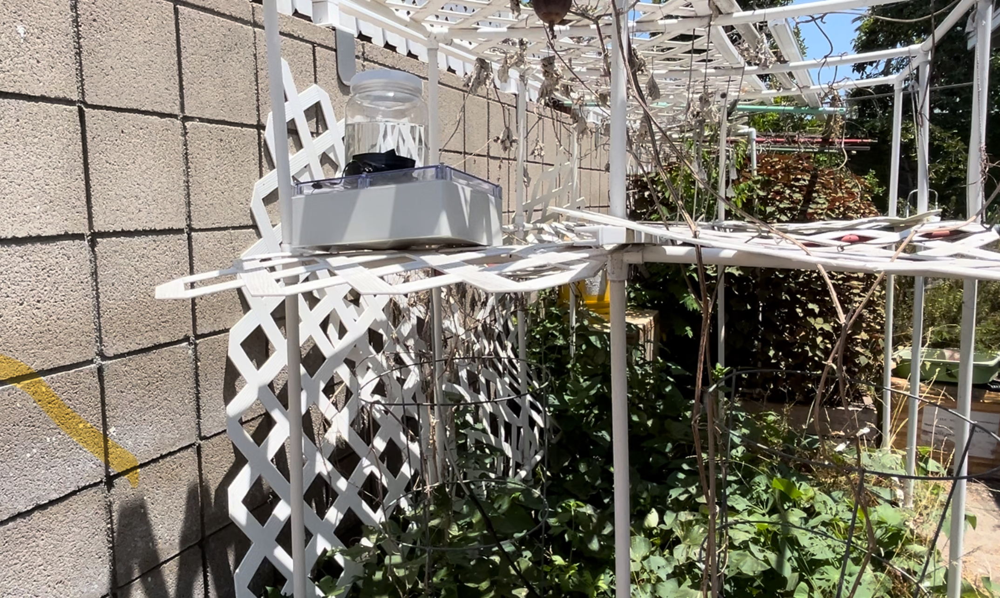

# Automatic Plant Watering
The goal of this project is to use an Arduino board and a soil moisture sensor to create an automated plant-watering system. To guarantee the ideal conditions for plant growth, the system monitors the amount of moisture in the soil and regulates the watering schedule. This project offers a pleasant way for those who want to combine technology with nature, and it is appropriate for both seasoned gardeners and tech enthusiasts.

You should comment out all portions of your portfolio that you have not completed yet, as well as any instructions:
```HTML 

```

| **Engineer** | **School** | **Area of Interest** | **Grade** |
|:--:|:--:|:--:|:--:|
| Chloe N | Cypress High | Mechanical Engineering | Freshmen



  

# Second Milestone


<iframe width="560" height="315" src="https://www.youtube.com/embed/2kijih_3vZg?si=mUrC14ph2yB290ev" title="YouTube video player" frameborder="0" allow="accelerometer; autoplay; clipboard-write; encrypted-media; gyroscope; picture-in-picture; web-share" referrerpolicy="strict-origin-when-cross-origin" allowfullscreen></iframe>

For my last milestone, I extended the sensor's range to reach the soil using long female-to-female wires. Then I sealed the main components in a waterproof container and drilled two holes to allow the pump to reach the water jug and use the water container. I also let the sensor out to be able to read the moisture of the soil without damaging the container.


# First Milestone


<iframe width="560" height="315" src="https://www.youtube.com/embed/e7WxbDQp2BE?si=KzUxI8TMhDCvte3d" title="YouTube video player" frameborder="0" allow="accelerometer; autoplay; clipboard-write; encrypted-media; gyroscope; picture-in-picture; web-share" referrerpolicy="strict-origin-when-cross-origin" allowfullscreen></iframe>

For my first milestone, I've completed my base project. My project is an automated system for maintaining optimal plant moisture levels, suitable for indoor and outdoor plants. It used a 12V power supply, soil moisture sensor, Arduino, and relay module. The sensor measured moisture percentages, and the Arduino controlled the water pump based on moisture percentage. The lcd screen displayed real-time moisture levels and pump status.

# Schematics 


# Code
```c++

LiquidCrystal lcd(12, 11, 10, 9, 8, 7);
const int AirValue = 150;
const int WaterValue = 137;
const int ThresholdValue = 135;
int soilMoistureValue = 0;
const int RelayPin = 2;


void setup()
{
  Serial.begin(9600);
  lcd.begin(16, 2);
  pinMode(RelayPin, OUTPUT);
  digitalWrite(RelayPin, HIGH);
}


void loop()
{
  soilMoistureValue = analogRead(A0);
  Serial.println(soilMoistureValue);


  lcd.setCursor(0, 0);
  lcd.print("Moisture: ");
  float moisturePercentage = map(soilMoistureValue, AirValue, WaterValue, 0, 100);
  lcd.print(moisturePercentage, 0);
  lcd.print("%");


  int upperLimit = ThresholdValue + 0.1 * (AirValue - WaterValue);
  int lowerLimit = ThresholdValue - 0.1 * (AirValue - WaterValue);


  if (moisturePercentage < 30.0)
  {
    digitalWrite(RelayPin, LOW);
    lcd.setCursor(0, 1);
    lcd.print("Pump: ON ");
  }
  else if (moisturePercentage > 70.0)
  {
    digitalWrite(RelayPin, HIGH);
    lcd.setCursor(0, 1);
    lcd.print("Pump: OFF");
  }
  else
  {
    lcd.setCursor(0, 1);
    lcd.print("Pump: ");
    if (digitalRead(RelayPin) == LOW)
    {
      lcd.print("ON");
    }
    else
    {
      lcd.print("OFF");
    }
  }


  delay(250);
  lcd.clear();
}
```

# Bill of Materials


| **Part** | **Note** | **Price** | **Link** |
|:--:|:--:|:--:|:--:|
| Complete Starter Kit Based on Arduino UNO R3 w/Detailed Free Tutorial Compatible with Arduino IDE (67 Items) |Has the basics of Arduino| $50 | <a href="https://www.amazon.com/REXQualis-Complete-Development-Detailed-Tutorial/dp/B07BLV5LFY/ref=sr_1_14_sspa?crid=305LJVW81VSYP&dib=eyJ2IjoiMSJ9.y5hO4bhfbA1ueyZdg3qkQkRP6PNtlNLXR7IGb14Ahec2kja4Bj8V9cSRqqEdfp2wnS0wYTfmPHFpGpXj-YJ1iMWZ5lPBMBj5mqQ66znlDc1Jk_D1uN01ZBXJflrdszA_CYSdA-6N6KAYOtOTPq7Gb-lNQ9YdVZm347GtOCkbYdtrVodd52BQfxx7v3MdBFNKJJaif0qcpN6tpvaC226bB-O9ipZ3Ulw-KnOQw3042HGlfgqlTLG4sltHGcEsvuExhTD8hs4wVazGuU6OFHGjAFEaH6WpGhpIfzUxb-iCWBU.MrVna1MXDuAIBJTBh5dSObKppWY7rAPIqpgNIKzJ6mk&dib_tag=se&keywords=arduino+soil+moisture+kit&qid=1718996652&sprefix=arduino+soil+moisture+kit%2Caps%2C78&sr=8-14-spons&sp_csd=d2lkZ2V0TmFtZT1zcF9tdGY&psc=1"> Link </a> |
| 4Pcs DC 3-5V Micro Submersible Mini Water Pump with 2pcs Clear Vinyl Tubing Flexible PVC Tubing(1M) for Aquariums Fish Tank Pond Fountain Hydroponics Garden | For pumping the water to the plant | $10 | <a href="https://www.amazon.com/Sipytoph-Submersible-Flexible-Aquariums-Hydroponics/dp/B097F4576N/ref=sr_1_2?crid=3GFUKHZSUW9UH&dib=eyJ2IjoiMSJ9.f57v5zs0c9bUBDkl7IMgi5J-OOSnvVkGwXoto3NdGdlCEjbJUUjvW9ZEdVK6YXKzS9bNKdmSi2C_g327DzUwUvSv2oRZmD4XsAAz8XLUWexWC0rkceIJudXbfSzO6t8peEF52XbJ_npQ1GJG04edtoNtzO5FGwyuhgpj7dVl_Xmui8a9F7sWlgeO1b1bpPSOokVeyYeEm0uKsENBu-DnaWGwl3R9QrqL8stfg51ZsVeZ34b8mINRZDXV5i67hrtksNmaHuRrpCuBN-s8ex--FNL-Xh7roHXUEF8JV9aajYQ.qnyDT8VLtaXGNz2AKKAfxn6w5qngrgE5GSJu-kAx4E4&dib_tag=se&keywords=arduino+water+pump&qid=1718754653&sprefix=arduino+water+pump%2Caps%2C124&sr=8-2"> Link </a> |


